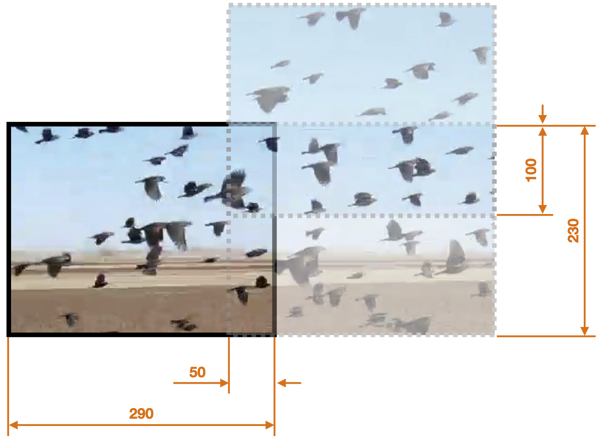
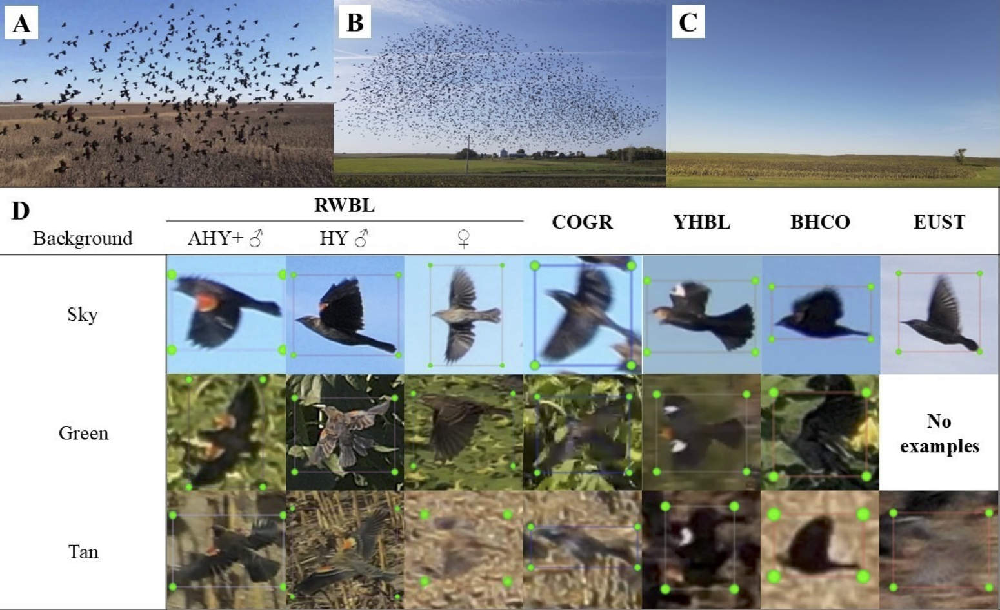
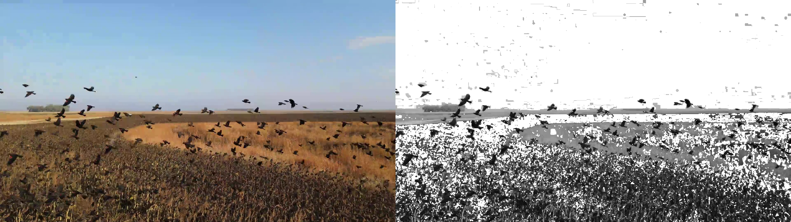

# BlackBirdDetection

An object detection pipeline for blackbird species built on **PyTorch** and **Torchvision**.  
It provides training and inference (`detect`) commands for bird datasets with XML annotations, background color removal, and augmentation.

---

<!-- Top row: two images side by side -->
<p align="center">
  
</p>

<p align="center">
  
</p>

<p align="center">
  
</p>

---

## 📂 Project Structure

```
BlackBirdDetection/
├── src/
│   ├── cli.py                # Entry point (train / detect commands)
│   ├── config.py             # Global configuration
│   ├── config.yaml           # Default YAML config
│   ├── data.py               # Dataset definitions
│   ├── data_loader.py        # Torch DataLoader wrapper
│   ├── engine.py             # Training / validation loop
│   ├── helper.py             # Utilities (device, collate_fn, etc.)
│   ├── model.py              # Model definitions (Faster R-CNN, etc.)
│   ├── augmentation.py       # Albumentations transforms
│   ├── bg_remove_histogram.py# Background removal helpers
│   ├── split_data.py         # Dataset split logic
│   └── detector/ (if reorganized package layout)
│
├── data/                     # Place your dataset here
│   ├── images/
│   └── original_annotations/
│
├── outputs/                  # Training artifacts will be written here
│   ├── runs/
│   │   └── <timestamp>/
│   │       ├── checkpoints/     # model_epoch_X.pth
│   │       ├── logs/            # training log files
│   │       ├── samples/         # predicted images during training
│   │       └── metrics.json     # final training metrics
│   └── detections/
│       ├── <timestamp>/
│       │   ├── predictions/     # images with bounding boxes
│       │   └── results.csv      # tabular results
│
├── README.md
└── requirements.txt / environment.yml
```

---

## ⚙️ Requirements

- Python **3.9–3.11**
- [PyTorch](https://pytorch.org/get-started/locally/) (CPU or CUDA build depending on your hardware)
- Torchvision
- Albumentations
- OpenCV
- Numpy `<2.0` (e.g. 1.26.x) for compatibility with current torch/numba

### Install dependencies

```bash
# conda (recommended)
conda create -n birddet python=3.10 -y
conda activate birddet
conda install -c conda-forge "numpy=1.26.*" "numba=0.59.*" "llvmlite=0.42.*" opencv -y
pip install torch torchvision albumentations loguru tqdm matplotlib ensemble-boxes pyyaml
```

---

## 📦 Managing Requirements

To make sure others can easily set up the project, you should generate a **`requirements.txt`** file.

### Option 1: Use the provided `requirements.txt`

```bash
# from repo root
pip install -r requirements.txt
```

### Option 2: Auto-generate requirements (from code imports)

You can auto-generate a clean `requirements.txt` (only for this project’s imports) using **pipreqs**:

```bash
pip install pipreqs
pipreqs src --force --savepath requirements.txt
```

> ⚠️ If you see syntax errors during scanning, fix the offending file or exclude it with `.pipreqsignore`.

After generation, add these lines manually if missing:

```txt
torch>=2.1.0
torchvision>=0.16.0
numpy<2
```

### Option 3: Pin dependencies manually

If you want a controlled environment, you can write a curated `requirements.txt`:

```txt
numpy==1.26.4
torch>=2.1.0
torchvision>=0.16.0
albumentations>=1.3.0
opencv-python>=4.8.0
loguru>=0.7.0
tqdm>=4.65.0
matplotlib>=3.7.0
ensemble-boxes>=1.0.9
pyyaml>=6.0
pytest>=8.0.0
black>=22.10.0
ruff>=0.1.0
```

Install with:

```bash
pip install -r requirements.txt
```

---

## 🚀 Running Without Installation

No need to install the project as a package. Run with `PYTHONPATH`:

```bash
# from repo root
export PYTHONPATH=$PWD/src

# show CLI help
python -m cli --help
```

Expected output:

```
usage: cli.py [-h] {train,detect} ...

Black Bird Detection

positional arguments:
  {train,detect}
    train         Train model
    detect        Use trained model to detect birds
```

---

## 🏋️ Training

```bash
export PYTHONPATH=$PWD/src
python -m cli train --config src/config.yaml
```

### Config file

The `config.yaml` defines:

- Dataset root (`../data/images`, `../data/original_annotations`)
- Training hyperparameters (epochs, batch size, learning rate, optimizer)
- Augmentation settings

### Training logs

```
2025-08-31 17:29:43 | INFO     | Starting Training -- Loading configuration...
2025-08-31 17:29:43 | INFO     | Scanning images in ../data...
2025-08-31 17:29:43 | INFO     | Classes: {'yhbl': 1, 'unid_blackbird': 2, 'rwbl_hy_female': 3}
2025-08-31 17:29:45 | INFO     | Training Data Size: 27
2025-08-31 17:29:45 | INFO     | Validation Data Size: 10
train epoch: 100%|███████████████████████████| 27/27 [00:12<00:00,  2.10it/s]
```

---

## 🔍 Detection / Inference

Use a trained checkpoint to run detection on new images:

```bash
export PYTHONPATH=$PWD/src
python -m cli detect --config src/config.yaml
```

### Output structure

```
outputs/detections/2025-08-31-18-45-12/
├── predictions/
│   ├── Trial_001_pred.jpg
│   ├── Trial_002_pred.jpg
│   └── ...
└── results.csv
```

- `predictions/` → images with bounding boxes drawn  
- `results.csv` → per-image predictions: filename, predicted class, confidence, bounding box coordinates  

---

## 📊 Expected Outputs

- **Training**  
  - Console logs (epochs, losses, metrics)  
  - Logs under `outputs/runs/<timestamp>/logs/`  
  - Checkpoints in `outputs/runs/<timestamp>/checkpoints/`  
  - Sample predictions in `outputs/runs/<timestamp>/samples/`  

- **Detection**  
  - Annotated images in `outputs/detections/<timestamp>/predictions/`  
  - CSV summary in `outputs/detections/<timestamp>/results.csv`

---

## ✅ Tips & Troubleshooting

- **NumPy 2.x errors** → downgrade to `numpy<2` (e.g. 1.26.x).  
- **`cv2.imread` warnings** → check dataset path in `config.yaml`; missing/misnamed files will cause empty loads.  
- **Device selection** → `helper.py` automatically chooses GPU if available:  
  ```python
  DEVICE = torch.device("cuda" if torch.cuda.is_available() else "cpu")
  ```

---

## 📌 Example End-to-End Run

```bash
# 1) activate env
conda activate birddet

# 2) set import path
export PYTHONPATH=$PWD/src

# 3) train
python -m cli train --config src/config.yaml

# 4) run detection
python -m cli detect --config src/config.yaml

# 5) check outputs
tree outputs/ -L 3
```

---

## 🔬 Scientific Background

This project implements the methods from the following study:

**Duttenhefner, Jessica L.; ElSaid, AbdElRahman A.; and Klug, Page E. (2025).**
*Machine Learning to Detect, Classify, and Count Blackbirds Damaging Agriculture Using Drone-Based Imagery: Supporting AI-Driven Automation for Deployment of Damage Management Tools.*
SSRN Scholarly Paper No. 5203080. [Available online](https://papers.ssrn.com/sol3/papers.cfm?abstract_id=5203080)

📊 **Associated Data**: A published dataset accompanies the paper. Please add the DOI link here once available:
`[DOI: 10.xxxx/zenodo.xxxxx]`

---

### 📝 Key Highlights from the Study
- Drone imagery collected in **sunflower fields (ND, 2021–2022)** with mixed-species blackbird flocks.
- Models developed:
  - **ResNet-18 CNN** → detected whole flocks (*95% accuracy*).
  - **Faster-RCNN** → detected individual birds (*65.7% accuracy, 97.6% precision*), counted individuals (±37.5–43.1% from ground truth), and classified RWBL by age/sex (adult males 89.8%, hatch-year males 27.6%, females 80%).
- **Background removal** was applied prior to training using **pixel-value histograms** to mask dominant background colors (e.g., sky, vegetation), improving detection and reducing false positives.
- Challenges discussed: camouflage of birds against vegetation, variability in drone angles, and image resolution constraints.

---

## 📜 License

MIT (or update to your license)
